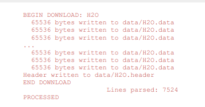
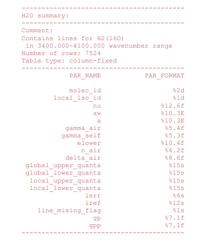
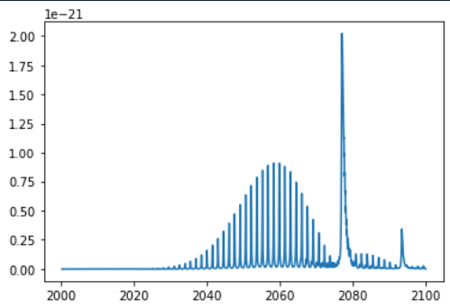

The coding period begins! Now, it's time for us contributors to pull up our socks and dive into coding.
I can't emphasize more on how interesting and difficult things could get

So let me talk about some little issues I raised and  PRs I generated

https://github.com/radis/spectro101/pull/9 : PR raised and merged - spectroscopy 101 <br/>
This tutorial notebook had some errors in it due to which some calculations and plots were wrong. I identified the issues and resolved it.<br/>
https://github.com/radis/radis/pull/481: PR raised and merged - whitespaces fix <br/>
While going through the documentation I realized that there were huge spaces around this diagram that I was studying. So, I corrected it with explicitly adding height and width parameters.<br/>

https://github.com/radis/radis/issues/482 :Raised Issue which was resolved <br/>
This was Raising KeyError while trying to execute fetch_hitemp('molecule_name') due to inconsistency in cache file creation and how it is being read <br/>
It was resolved with Radis 0.13 (pip version) and the latest develop version from Github.
https://github.com/radis/radis/issues/483 : Raised and Closed issue with solution <br/>
ModuleNotFoundError: No module named 'radis_cython_extensions' when executing bash gendocs.sh<br/>
This can be fixed by installing Microsoft C++ Build Tools from link- https://visualstudio.microsoft.com/visual-cpp-build-tools/ .<br/>
https://github.com/radis/radis/issues/484: Raised And Closed issue with solution <br/>
the exception Microsoft Visual C++ 14.0 or greater is required. Get it with "Microsoft C++ Build Tools": https://visualstudio.microsoft.com/visual-cpp-build-tools/ obtained while installing radis using pip install -e . -v <br/>
This can be fixed by installing Microsoft C++ Build Tools from link- https://visualstudio.microsoft.com/visual-cpp-build-tools/ <br/>

Now coming to my project,firstly my task for Non-Air Diluent project was to somehow get the broadening coeffcients for a specific 
molecule using HAPI.
I started off by the reading the HAPI manual to understand the functioning of HAPI. It was structured properly so 
I started implementing the code as well to understand it properly.

First to use any functionlity of hapi we need to use `from hapi import *` (for importing all functions, we can mention any particulr one too).
To start working with HAPI, the user should import all functions from the module “hapi.py”:

First, let's choose a folder for our local database. Every time you start your Python project, you have to 
specify explicitly the name of the database folder db_begin('data')
So, let's download some data from the server and do some processing on it. Suppose that we want to 
get line-by-line data on the main isotopologue of H2O.

For retrieving the data to the local database, the user has to specify the following parameters:<br/>
1) Name of the local table which will store the downloaded data.<br/>
2) Either a pair of molecule and isotopologue HITRAN numbers (M and I), or a "global" isotopologue 
ID (iso_id).<br/>
3) Wavenumber range (nu_min and nu_max)<br/>

If you specify a name which already exists in your local folder, the existing table with that name 
will be overwritten.
To learn about the table we just downloaded, let's use a function "describeTable".

The local data is downloaded from the HITRANonline portal (http://hitran.org) using API functions 
(fetch and fetch_by_ids). Downloaded data is stored in the folder which was specified in a call to 
db_begin().
The structure of a local data folder is as follows (assuming that you have already downloaded several 
tables from HITRANonline):
Folder name<br />
 | <br />
 |----- table1.data<br />
 | table1.header<br />
 |<br />
 |----- table2.data<br />
 | table2.header<br />
…<br />
 |----- tableN.data<br />
 tableN.header<br />

The typical format is as follows: <table_name>.data for line-by-line data, and <table_name>.header
for table description (field names and positions, format, number of lines etc...). The default file format 
is 160-character HITRAN format .

I learned the basics about  hapi and its functioning like -

choose a folder for our local database <br/>
`db_begin('data')` <br/>

To get additional information on function fetch, call getHelp: <br/>
`getHelp(fetch)` <br/>

To download the data, simply call the function "fetch". This will establish a connection with the main 
server and get the data using the parameters listed above. For example: <br/>
`fetch('H2O',1,1,3400,4100)` <br/>

 <br/>

To get a list of tables which are already in the database, use the tableList() function (it takes no 
arguments):<br/>
`tableList()`<br/>

To learn about the table we just downloaded, let's use a function "describeTable"<br/>
describeTable('H2O')<br/>



Also, I learned about the select() function and how to apply certain conditions to query filtering conditions, accessing columns, specifiying a list of paremeters
saving query to disk.<br/>

To calculate an absorption coefficient cross section:<br/>
```
fetch('CO2',2,1,2000,2100)<br/>
nu,coef = absorptionCoefficient_Lorentz(SourceTables='CO2', Diluent={'air':1.0})
from pylab import plot 
plot(nu,coef)
```

This example calculates a Lorentz cross section using the whole set of lines in the CO2 table
