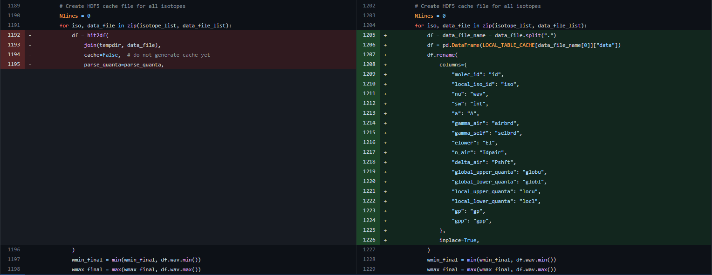
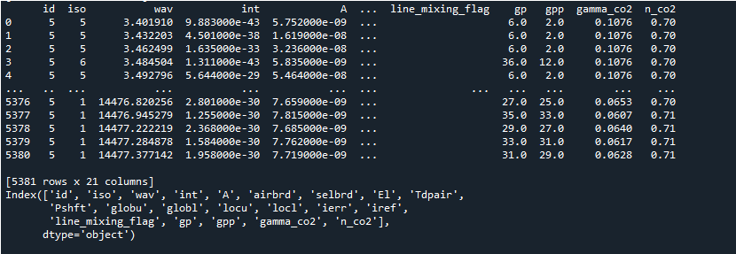

Entering into the 5th week I created a PR https://github.com/radis/radis/pull/492  to address the task to add, retrieve and store the extra params for all (9) isotopes of a molecule(CO)

I checked if extra_params is not empty then Parameters = extra_params will be passed in fetch() method
(extra_params = ['gamma_CO2',n_CO2'] ----> we will pass this via fetch_hitran()
This will allow addition of these extra_params like gamma_CO2, n_CO2 etc in the .data file for that respective isotope (CO_1.data, CO_2.data....etc)
Then I am retrieving these column values using getColumn of hapi.<br/>
After that I stored this data into a dataframe temp_df with the column name as CO_1_gamma_CO2, CO_1_n_CO2..(molecule_isotope_param) to distinguish the isotopes columns.
Similarly, for the rest of the isotopes this temp_df will keep on appending column values.<br/>

After retrieving and adding these columns to the dataframe, I have deleted these extra parameters from the .data file
It helps in not hindering the normal workflow and to bypass the parsing methods which won't work for these extra_params added in .data anyways.It behaves like the normal workflow without passing extra_params in fetch() method.

Hence, we will get a consolidated dataframe with these extra parameters for all
isotopes for a molecule. If values are absent then they are populated as NaN

Now, I need to add these extra_params in the final CO.hdf5 file(molecule.hdf5).<br/>

this time I modified the code to create a consolidated .hdf5 file for extra_params of a molecule. In this hdf5 file, all values are appended isotope wise.
 For eg- if we're adding gamma_CO2 and n_CO2 for CO molecule then the .hdf5 will initially have values of gamma_CO2 and n_CO2 for CO_1 (isotope 1),
  then values of gamma_CO2 and n_CO2 for CO_2 (isotope 2) will be appended and so on.

Now, if we want to merge this extra_params.hdf5 with the molecule.hdf5.....then the sequence of data should be same in both right? 
In my extra_params.hdf5 I have appended values sequentially as per isotope. I wonder if the molecule.hdf5 file is also created by sequentially appending every isotope data in the same order like isotope1,isotope2....so on.
To this query Dr. Erwan had told that in fetch_hitran() we sort the df with `wav` column and hence my extra_params.hdf5 data was not aligned with
the molecule.hdf5 file data.<br/>


Eventually, this method up until now making use of getColumn and parsing these extra columns were getting more complicated and 
and even line data wasn't aligning due to inconsistent parsing.<br/>

Hence, Dr. Erwan suggested to replace RADIS parsers with HITRAN parsers.<br/>
HIs conclusions so far:<br/>
1. db_begin loads all the file content in a dictionary LOCAL_TABLE_CACHE. It's very easy to access from there. Just use this rather than the more complicated getColumn() approach ?<br/>
2. In the perf tests he just run, HAPI's db_begin parsing is ~3x faster than the RADIS's optimized hit2df.  Well done HITRAN team.<br/>
Therefore we should refactor radis.io.hitran.py to use the db_begin + read LOCAL_TABLE_CACHE approach rather than use hit2df.It would improve performances; and make it easier to parse & add your own columns.    
To get me started he even added a proof-of-concept of how to get a Pandas dictionary from the LOCAL_TABLE_CACHE
If it works well, same could be done for parsing HITEMP files (only unknown: HITEMP files do not come with a .header file ; will it still work ? ). It could be a major improvement --> HITEMP-H2O parsing takes full-3 hrs (!!).  You can play around with OH download & parsing; which is quite fast.<br/>

So I now started working on the same and was able to successfully implement and execute it.
I showed the implementation via https://github.com/radis/radis/pull/495 

This code change addressed refactoring of radis.io.hitran.py to use the db_begin + read LOCAL_TABLE_CACHE approach rather than use hit2df.<br/>

1.I've replaced hit2df with pd.DataFrame(LOCAL_TABLE_CACHE[data_file_name[0]]["data"]) and renamed the columns as Dr. Erwan had mentioned in the proof of concept of how to get a Pandas dictionary from the LOCAL_TABLE_CACHE.<br/>


Also, by passing Parameters = ['gamma_CO2','n_CO2'] in fetch() the columns are loaded in LOCAL_TABLE_CACHE and is parsed together along with all other columns.<br/>
Hence, now just by passing these extra columns as Parameters = ['gamma_CO2','n_CO2'] in fetch() function we obtain a single CO.hdf5 (molecule.hdf5) file in which basic + extra Columns are present . ( All row data / line data are now aligned)<br/>
The final df returned by fetch_hitran() also contains basic + extra columns. If for a given molecule a column is not present then it simply adds NaN values to df and .hdf5 file for that column.
```
from radis.io.hitran import fetch_hitran
df = fetch_hitran("CO",extra_params = ["n_CO2","gamma_CO2"])
print(df)
print(df.columns) 
```



Yay! the db_begin + read LOCAL_TABLE_CACHE approach worked like a charm and loaded basic + extra columns.<br/>

Now some questions that Dr. Erwan asked and the answers I could find- <br/>

1.Do you have a way to know all the possible extra parameters for a given molecule ?<br/>
Answer: -> No, not for any specific molecule but I searched in hapi.py only columns present in PARAMETER_META is possible to load for any molecule. If we try we put any other column eg. gamma_O2  which is not present in PARAMETER_META then it will return keyError: "gamma_O2".<br/>
2. if not, which ones to download ?<br/>
Answer:  --->  As per above point,I believe if one needs to load extra columns(be it any) we can load all columns  of  PARAMETER_META for them . Hence they'll have all possible extra columns.
Or else, the user will have to provide the column name as input in
 fetch_hitran('CO', extra_params = ['gamma_CO2','n_He'])
If the column provided by user is not present in `PARAMETER_META` then it will give -
keyError : 'column_name' <br/>
If columns provided is present in PARAMETER_METAbut values are not there(usually wriiten in .data like #) then Nanvalues will be populated.

3. what if the database has already been downloaded (true for most current radis users) but we want to add new parameters? If you can only download selectively the new parameters, then we could append them to another file (siilar to the *_extra.hdf5 approach you had) . If you'll need to re-download everything anyway, then maybe it's just better to replace the existing database with the new one.<br/>
Answer:  ----> I couldn' t find any selective way since in hapi.py they're fetching basic + extra together......if extra is empty then only basic remains. So I guess, since we have to re-download everything anyway....then as you mentioned replacing db would be better.<br/>

4. if replacing the database, make sure that already downloaded parameters are still downloaded. Else you'll end up with users having to redownload the full database each time they'll change a gas composition and require first gamma_CO2 then gamma_H2O for instance. Avoid this.
Answer:  -----> As I mentioned above we can download all columns present in PARAMETER_META  for a molecule so they'll eventually have all possible extra columns for that molecule .
Or  user will always have to provide input for the column they want in fetch_hitran() and download latest dataset with the previous downloaded extra parameters as well.<br/>


Now,  loading all columns isn't that simple because there is one problem that for some columns in even PARAMETER_META it's giving  "INTERNAL SERVER ERROR".
Hence, we need to be selective about columns in PARAMETER_META too!
We're trying to find a way to select which columns in PARAMETER_META are required as loading all columns would crash.

