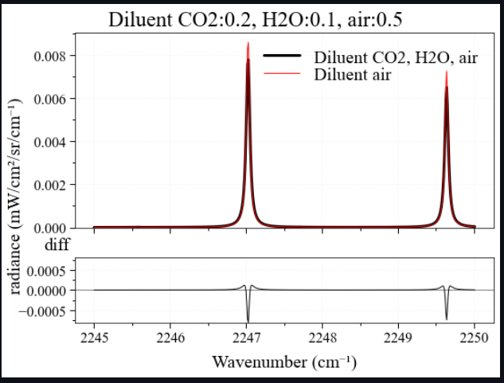

Now since fetching of extra columns which includes broadening coeffcients was completed I had to pull the the fetch_hitran_update changes into non_air_diluent_2 branch
and started working on top of that.

This PR https://github.com/radis/radis/pull/495  

  1) Modifying calc_spectrum and SpectrumFactory to add diluent parameter 
  2) Updated pressure_broadening_HWHM for non-air diluents 
  3) Added broadening coefficient list 
  4) Added required functions to adjust diluent parameter
  5) Added test functions as well

The lineshapes with diluent and without diluent had some differences like displayed in the plot below  

This PR was completed after some iterations to include suggestions provided by mentors Dr.Erwan and Mr.Anand which were beneficial from the user perspective. 

With this the final week for contribution 5th Sept-12th Sept ended and so did Google Summer Of Code 2022 journey! But Open Source Contibution will never end and I'll make sure to keep on contributing
to Open Source and share my knowledge and experience that I gained throughout the GSoC 2022 journey with others.

All in all, this phase of life was a fantastic one! Never did I expect to be able to be a part of something great! I have learned and grown a lot during the course of these months.
I have improved in my problem solving abilities and programming skills to a great extent. All those deep and thorough brainstorming sessions and communications with extremely intelligent mentors
made this possible. Also, my teammates helped to sail through as we used to constantly share our project experiences and tried to solve each others doubts whenever possible which made this journey 
even more rich!
I'm glad I was a part of Google Summer Of Code 2022! Hope to keep on contributing! :)
